# Project 1

### Information:
```
Name: Dhruv Srikanth
```

# Milestone 1 - Serial Solver with constant u,v and periodic boundaries

The purpose of this assignment is to demonstrate a simulation of advection/diffusion through explicit time stepping. We start with an initial gaussian blob (at the starting time of the simulation) and perform an explicit time step during the simulation. Essentially, this can be seen or interpreted as the advection or diffusion of fluid or heat, something that is evident in the outputs shown in the **graph outputs** section. This is a serial implementation of the simulation takes about 48 seconds to run on my local system for **20000** timesteps. The estimated memory usage, input parameters and simulation status are indicated as outputs in the terminal at the time of running the binary file **advection_simulation**.

### Files:

The following is a short description of what the **relavent** files are in this directory:

1. advection_simulation.cpp - C++ code file with functions for performing the advection simulation and writing the output to a file in the ASCII format. This also performs the simulation and saves the output for a used specified input, for **10000** timesteps, for **20000** timesteps and saves the ouput of the initial gaussian grid. For the initial gaussian grid, the input parameters used are x_0 = y_0 = L/2 and the spread across the x and y directions is taken as L/4. The input parameters for the simulation with **10000** and **15000** timesteps are as folows - 
```
N = 400 (Matrix Dimension)
NT = Number of timesteps
L = 1.0 (Physical Cartesian Domain Length) 
T = 1.0e6 (Total Physical Timespan)
u = 5.0e-7 (X velocity Scalar)
v = 2.85e-7 (Y velocity Scalar)
```
2. advection_simulation - Binary executable that is created after building the advection_simulation.cpp file.

3. generate_plots.py - Python script for reading the saved outputs and creating a colored plot of the NxN grid.

4. initial_gaussian.txt - Output in the ASCII format of the initial gaussian grid.

5. initial_gaussian.png - Visualization of the output of the initial gaussian grid as a graph.

6. simulation_10000_timesteps.txt - Output in the ASCII format of the simulation for **10000** timesteps.

7. simulation_10000_timesteps.png - Visualization of the output of the simulation for **10000** timesteps.

8. simulation_15000_timesteps.txt - Output in the ASCII format of the simulation for **15000** timesteps.

9. simulation_15000_timesteps.png - Visualization of the output of the simulation for **15000** timesteps.

10. simulation_user_specified_timesteps.txt - Output in the ASCII format of the simulation for **user specified** inputs.

11. simulation_user_specified_timesteps.png - Visualization of the output of the simulation for **user_specified** inputs.

12. REPORT.md - Markdown file containing the report on the simulation and experimentation.

13. Project1_Milestone1.pdf - PDF file of the project 1 milestone 1 pertinent information and deliverables.

### Inputs:

When running the advection_simulation executable, the following inputs must be provided (order of inputs is the same as the order of inputs provided below) - 

```
N - Matrix Dimension
NT - Number of timesteps
L - Physical Cartesian Domain Length)
T - Total Physical Timespan
u - X velocity Scalar
v - Y velocity Scalar
```

### Build, Run and Visualization Instructions:

1. First build the binary executable for advection_simulation.cpp - 
```
g++ ./milestone-1/advection_simulation.cpp
```

2. Run the executable just created along with the user inputs (example shown below) - 
```
./milestone-1/advection_simulation 400 20000 1.0 1.0e6 5.0e-7 2.85e-7 
```

3. Run the python script to generate the plots - 
```
python3 ./milestone-1/generate_plots.py
```

### Output Graphs:

1. Initial Gaussian:

Inputs - 
```
L = 1.0 (Physical Cartesian Domain Length) 
```

Output Visualized - 


2. Simulation for 10000 timesteps:

Inputs - 
```
N = 400 (Matrix Dimension)
NT = 10000 (Number of timesteps)
L = 1.0 (Physical Cartesian Domain Length) 
T = 1.0e6 (Total Physical Timespan)
u = 5.0e-7 (X velocity Scalar)
v = 2.85e-7 (Y velocity Scalar)
```

Output Visualized - 

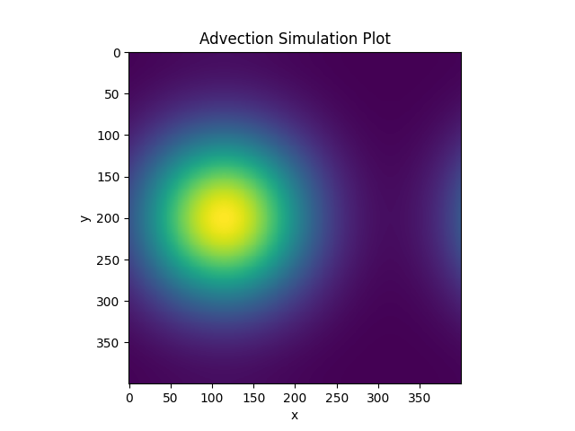

3. Simulation for 15000 timesteps:

Inputs - 
```
N = 400 (Matrix Dimension)
NT = 15000 (Number of timesteps)
L = 1.0 (Physical Cartesian Domain Length) 
T = 1.0e6 (Total Physical Timespan)
u = 5.0e-7 (X velocity Scalar)
v = 2.85e-7 (Y velocity Scalar)
```

Output Visualized - 


4. Simulation for 20000 timesteps:

Inputs - 
```
N = 400 (Matrix Dimension)
NT = 20000 (Number of timesteps)
L = 1.0 (Physical Cartesian Domain Length) 
T = 1.0e6 (Total Physical Timespan)
u = 5.0e-7 (X velocity Scalar)
v = 2.85e-7 (Y velocity Scalar)
```

Output Visualized - 

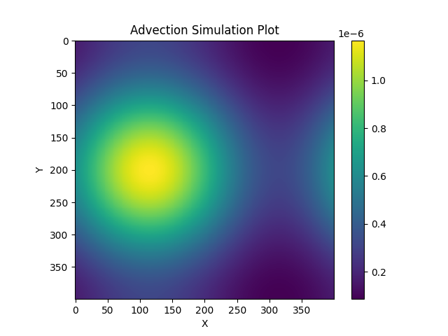


### Output Interpretation:

As we can see, from the initial gaussian plot, as you increase the number of timesteps (10000 to 15000 to 20000), there is a diffusion seen through the size of the blob increasing. In my view, this can be interpreted almost like heat diffusing outward and throughout the gaussian grid we have specified.


# Milestone 2 - OpenMP parallel solver

The purpose of this assignment is to demonstrate the speedups possible when parallelizing our code utilizing different threads on our systems with the help of openmp. This is done for the simulation of advection/diffusion through explicit time stepping.

## Processor:

```
Chip:               Apple M1 Pro
Number of Cores:	8 (6 performance and 2 efficiency)
```

## Compiler:

```
Compiler:           GNU C++ compiler - g++
Version:            11
```

## Sample Run:
1. Step 1 - 

(With optimization flags)
```
g++-11 ./milestone-2/advection_simulation.cpp -o ./milestone-2/advection_simulation -fopenmp -O3 -march=native -mtune=native -ffast-math 
```

(Without optimization flags)
```
g++-11 ./milestone-2/advection_simulation.cpp -o ./milestone-2/advection_simulation -fopenmp
```

2. Step 2 - 
```
./milestone-2/advection_simulation 400 20000 1.0 1.0e6 5.0e-7 2.85e-7            
```

## Best Performance Parameters:
```
Cores:              6
Schedule:           guided
```

## Serial vs. Parallel Outputs:

To view whether there is any difference between the serial and parallel code outputs, we can run a diff. This is shown below - 
```
diff ./milestone-1/file_name.txt ./milestone-2/file_name.txt    
```

The **file_name.txt** can be any of the following files - 
1. initial_gaussian.txt
2. simulation_10000_timesteps.txt
3. simulation_15000_timesteps.txt
4. simulation_user_specified_timestep.txt

If there is no change in the output, we will get no output in the terminal after running the above code as there is no difference to be shown. If there is a difference between the two output files, we will see a representative output in the terminal after running the above command.

Upon running the code for all 4 file names listed above, there was no output in the terminal, indicating that the serial and parallel implementations had no change in output. This means that there **is** bitwise reproducibility.


## Best Grind Rate (N = 10000 and milestone-1 inputs):

Inputs - 
```
N = 10000 (Matrix Dimension)
NT = 20000 (Number of timesteps)
L = 1.0 (Physical Cartesian Domain Length) 
T = 1.0e6 (Total Physical Timespan)
u = 5.0e-7 (X velocity Scalar)
v = 2.85e-7 (Y velocity Scalar)
```

Best Grind Rate - 
```
Best Grind Rate = 39 timesteps/second
```

## Strong Scaling Analysis:

### Input - (1)
```
N = 3200 (Matrix Dimension)
NT = 400 (Number of timesteps)
L = 1.0 (Physical Cartesian Domain Length) 
T = 1.0e3 (Total Physical Timespan)
u = 5.0e-7 (X velocity Scalar)
v = 2.85e-7 (Y velocity Scalar)
```

### Data Points - (1)


| Cores       | time (s)    |
| ----------- | ----------- |
| 1           | 36.4707     |
| 2           | 18.6834     |
| 3           | 12.7379     |
| 4           | 9.7075     |
| 5           | 7.7995     |
| 6           | 7.3461     |
| 7           | 7.1528     |
| 8           | 7.5088     |

### Plot - (1)

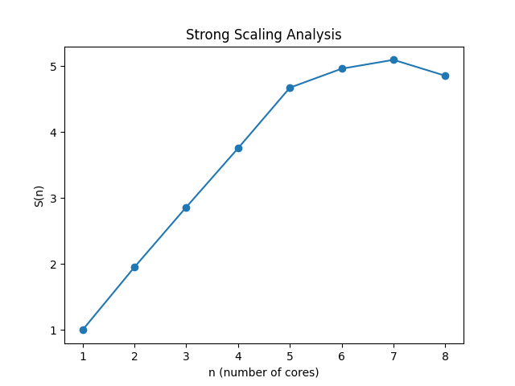

We can observe the following - 
```
n_1/2 = 5
n_0.8 = 6
```

### Input - (2)
```
N = 200 (Matrix Dimension)
NT = 400 (Number of timesteps)
L = 1.0 (Physical Cartesian Domain Length) 
T = 1.0e3 (Total Physical Timespan)
u = 5.0e-7 (X velocity Scalar)
v = 2.85e-7 (Y velocity Scalar)
```

### Data Points - (2)


| Cores       | time (s)    |
| ----------- | ----------- |
| 1           | 0.15496     |
| 2           | 0.96304     |
| 3           | 0.090706     |
| 4           | 0.058696     |
| 5           | 0.064069     |
| 6           | 0.068613     |
| 7           | 0.087449     |
| 8           | 0.092364    |

### Plot - (2)

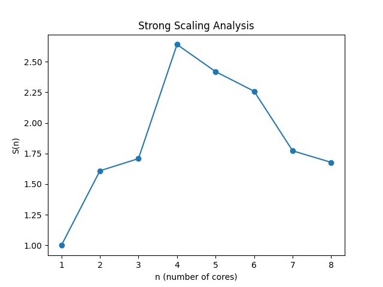


## Weak Scaling Analysis:

### Input -
```
N = 800 (Matrix Dimension) (1 thread - increases as the threads count increases)
NT = 400 (Number of timesteps)
L = 1.0 (Physical Cartesian Domain Length) 
T = 1.0e3 (Total Physical Timespan)
u = 5.0e-7 (X velocity Scalar)
v = 2.85e-7 (Y velocity Scalar)
```

### Data Points -


| Cores       | N      | time (s)    |
| ----------- | ----------- |----------- |
| 1           | 800     | 2.34124    |
| 2           | 1131     | 2.35585     |
| 3           | 1385     | 2.41521     |
| 4           | 1600     | 2.40799     |
| 5           | 1788     | 2.4846    |
| 6           | 1959     | 2.62962     |
| 7           | 2116     | 3.41103     |
| 8           | 2262    | 3.96412     |

### Plot -

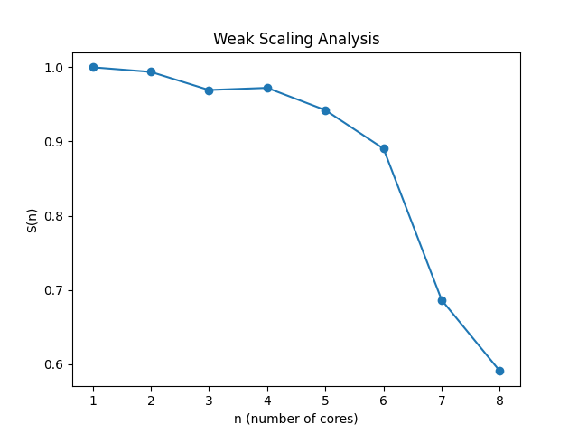


# Final Version - Hybrid MPI/OpenMP solver

In this final portion of the project, we are aiming to reduce the memory latency for each node by **distributing** the workload across different nodes. Each node contains several processors which will work in **parallel** to compute that node's portion of the workload. Each node also uses memory independent to the other nodes and therefore, allows for lower memory latency for each of the threads as there are less threads and processors trying to access memory thereby reducing the wait time. This is the **hybrid MPI (for distributed workloads) - OpenMP (for parallel workloads)** solver for the advection/diffusion simulation.

### Inputs:
When running the advection_simulation executable, the following inputs must be provided (order of inputs is the same as the order of inputs provided below). This must be provided in the run_sim.sh (or run_sim_backup.sh if required)-

```
N - Matrix Dimension
NT - Number of timesteps
L - Physical Cartesian Domain Length)
T - Total Physical Timespan
u - X velocity Scalar
v - Y velocity Scalar
n - Number of threads (for parallelizing)
scheme - Computation scheme (options - "LAX", "First-Order-Upwind", "Second-Order-Upwind")
```

### Sample Run (several ways):

1. Run the script run_sim.sh after editing the script with the desired parameters mentioned above (manual linking of MPI needed to be done in order to use a different compiler) - 
```
./final-version/run_sim.sh
```

2. If the above did not work (in the case that automatic linking of MPI works for you) -  
```
./final-version/run_sim_backup.sh
```

3. Running without a run script - 
Copy uncommented lines from the run scripts and execute them one after the other.


### Output Graphs:

Inputs - 
```
N = 400 (Matrix Dimension)
NT = 10000 (Number of timesteps)
L = 1.0 (Physical Cartesian Domain Length) 
T = 1.0e6 (Total Physical Timespan)
u = 5.0e-7 (X velocity Scalar)
v = 2.85e-7 (Y velocity Scalar)
n = 2 (Number of threads)
scheme = "LAX" (Computation scheme)
```

```
Nodes: 4
Threads per processor: 2
```

1. Initial Gaussian:


2. Simulation for 10000 timesteps:


3. Simulation for 20000 timesteps:

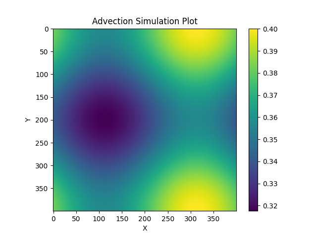

We can perform a **diff** check between these output files and the corresponding output files in mileston-1 to check for bitwise reproducability. This will show us that there is **not** bitwise reproducability in the output between the serial (or parallelized) and the hybird versions of the simulation. The outputs between serial and parallelized versions of the simulation are bitwise reproducable. This is because of minor changes caused in the hybrid version due to floating point associativity but does not change the accuracy of the simulation. This is indicated by the images shown above.


### Performance Analysis:

Input used throughout performance analysis - 
```
N = 10000 (Matrix Dimension)
NT = 20000 (Number of timesteps)
L = 1.0 (Physical Cartesian Domain Length) 
T = 1.0e6 (Total Physical Timespan)
u = 5.0e-7 (X velocity Scalar)
v = 2.85e-7 (Y velocity Scalar)
n = 48 (number of threads) (Only passed when we are testing with OpenMP turned on)
scheme = "LAX"
```

```
Optimal number of OpenMP threads per rank: 48
```

#### Strong Scaling (1 MPI rank per node) - 

```
--cpus-per-task = 48
```

Data - 

| Nodes       | Grind Rate (iter/s)      | time (s)    |
| ----------- | -----------             |----------- |
| 1           | 48                   | 416.7  |
| 4           | 257                   | 77.8     |
| 16           | 1716                  | 11.6     |


Graph - 

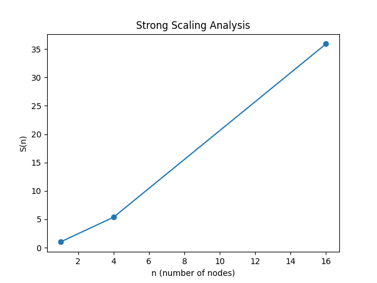

#### Strong Scaling (1 MPI rank per core) - 

```
--ntasks-per-node = 36
```

Data - 

| Nodes       | Grind Rate (iter/s)      | time (s)    |
| ----------- | -----------             |----------- |
| 1           | 86                   | 232.6  |
| 4           | 421                   | 47.5     |
| 16           | 1712                  | 11.7     |

Graph - 

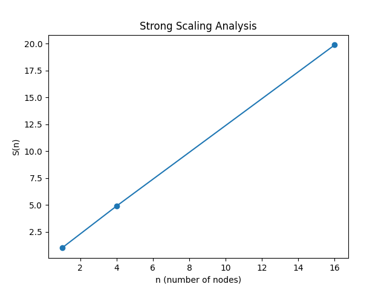

#### Weak Scaling (1 MPI rank per node) - 

```
--cpus-per-task = 48
```

Data - 

| Nodes       | N      | Grind Rate (iter/s)    | time (s)    |
| ----------- | -----------             |----------- | ----------- |
| 1           | 10000                   | 52  | 384.6   |
| 4           | 20000                   | 50     | 400.0    |
| 16           | 40000                  | 47     | 425.5    |

Graph - 

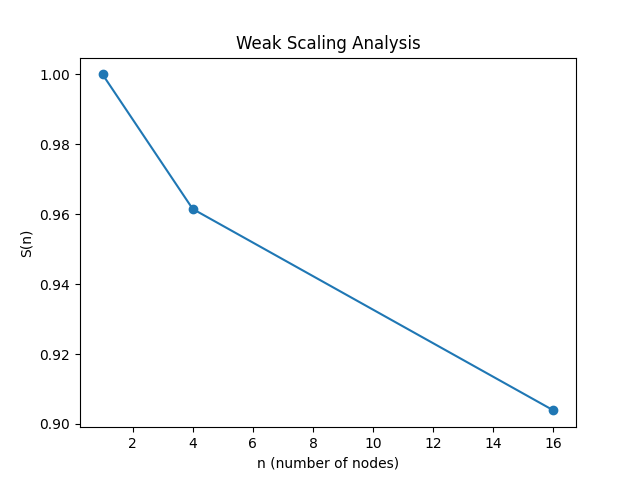

#### Weak Scaling (1 MPI rank per core) - 

```
--ntasks-per-node = 16
```

Data - 

| Nodes       | N      | Grind Rate (iter/s)    | time (s)    |
| ----------- | -----------             |----------- | ----------- |
| 1           | 10000                   | 46  | 434.8   |
| 4           | 20000                   | 46     | 434.8    |
| 16           | 40000                  | 44     | 454.5    |

Graph - 

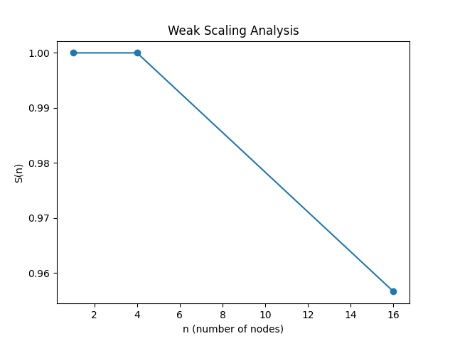

# Final Version - First-Order Upwind Scheme
The change from the previously used LAX scheme is minor. Most portions of the algorithm remain the same, however, the only parts I needed to modify in the code are was the final computation for C_n[i][j] at time step n=n+1. Using the equations provided in the project rubric, I got an equation for C_n+1 in terms of C_n and added this with simple logical checks for |(u,v)| > 0 and |(u,v)| < 0.

### Output Graphs:

Inputs - 
```
N = 400 (Matrix Dimension)
NT = 10000 (Number of timesteps)
L = 1.0 (Physical Cartesian Domain Length) 
T = 1.0e6 (Total Physical Timespan)
u = 5.0e-7 (X velocity Scalar)
v = 2.85e-7 (Y velocity Scalar)
n = 2 (Number of threads)
scheme = "First-Order-Upwind" (Computation scheme)
```

```
Nodes: 4
Threads per processor: 2
```

1. Initial Gaussian:


2. Simulation for 10000 timesteps:

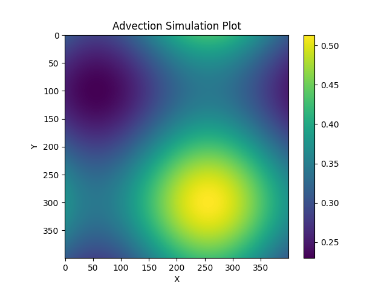

3. Simulation for 20000 timesteps:


# Final Version - Non-Uniform (u,v) Support
Although I wanted to complete the entire assignment, due to most of my time being spent on debugging my MPI program, I was not able to complete this in time. More on this in the shortcomings sections.

# Final Version - Second-Order Upwind Scheme
The change from the previously used LAX scheme is minor. Most portions of the algorithm remain the same, however, the only parts I needed to modify in the code are was the final computation for C_n[i][j] at time step n=n+1 and the number of ghost cells I am passing. Using the equations provided in the project rubric, I got an equation for C_n+1 in terms of C_n and added this with simple logical checks for |(u,v)| > 0 and |(u,v)| < 0. However, it was not as simple as that for the ghost cells portion. First, I checked during the simulation, whether the scheme was for second-order upwind and if so, I created arrays of size 2N to send instead of N as done when only 1 level of ghost cells is required. I then sent these values and did a check inside my boundary conditions for the kind of scheme. If it was the second-order upwind scheme, I appropriately extracted the ghost cells required for the C_n+1 computation I solved for earlier. I think, the best way to do this is to send 2N blocks of contiguous memory rather than making 2 sends, each with N blocks of contiguous memory, as the cost of message passing between nodes is relatively higher.

### Output Graphs:

Inputs - 
```
N = 400 (Matrix Dimension)
NT = 10000 (Number of timesteps)
L = 1.0 (Physical Cartesian Domain Length) 
T = 1.0e6 (Total Physical Timespan)
u = 5.0e-7 (X velocity Scalar)
v = 2.85e-7 (Y velocity Scalar)
n = 2 (Number of threads)
scheme = "Second-Order-Upwind" (Computation scheme)
```

```
Nodes: 4
Threads per processor: 2
```

1. Initial Gaussian:

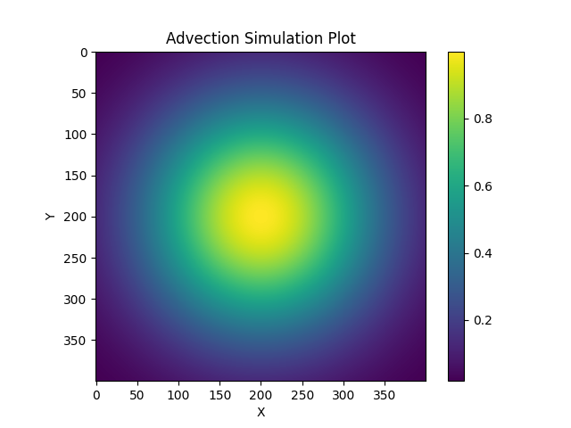

2. Simulation for 10000 timesteps:


3. Simulation for 20000 timesteps:

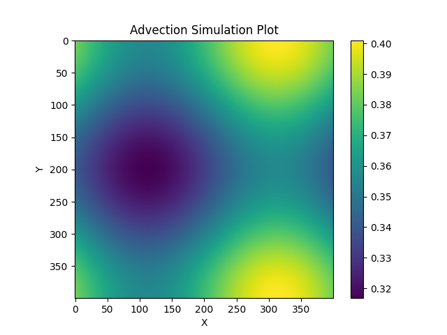


# Shortcomings:
1. I would like to learn make - For this simulation, I have been compiling and running scipts by creating a shell script (run_sim.sh). Since I did not know make and did not have time to learn it by the deadline, I am submitting the run_sim.sh script in place of the make file as Professor Siegel suggested.

2. I was not able to figure how to implement support for non-uniform u and v - If I had finishing debugging my MPI code a little sooner, I think I would have been able to add support for non-uniform u and v however, I ran out of time.
