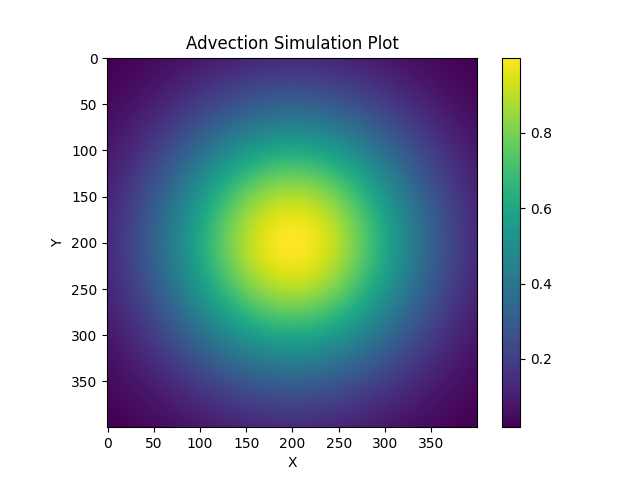
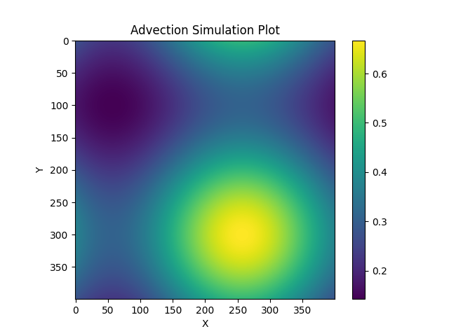
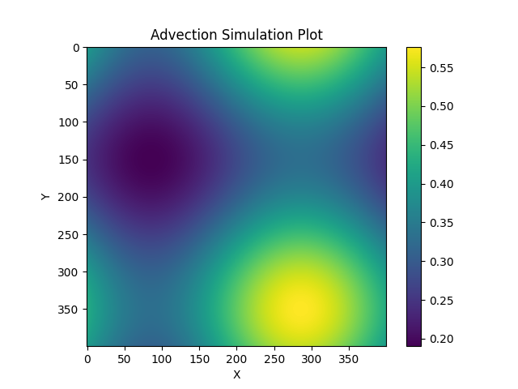
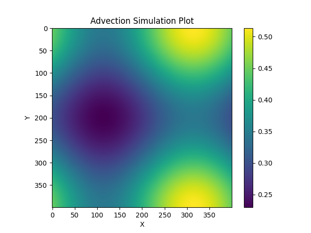

# Milestone 1 (Project 1)

The purpose of this assignment is to demonstrate a simulation of advection/diffusion through explicit time stepping. We start with an initial gaussian blob (at the starting time of the simulation) and perform an explicit time step during the simulation. Essentially, this can be seen or interpreted as the advection or diffusion of fluid or heat, something that is evident in the outputs shown in the **graph outputs** section. This is a serial implementation of the simulation takes about 48 seconds to run on my local system for **20000** timesteps. The estimated memory usage, input parameters and simulation status are indicated as outputs in the terminal at the time of running the binary file **advection_simulation**.

### Files 

The following is a short description of what the **relavent** files are in this directory:

1. advection_simulation.cpp - C++ code file with functions for performing the advection simulation and writing the output to a file in the ASCII format. This also performs the simulation and saves the output for a used specified input, for **10000** timesteps, for **20000** timesteps and saves the ouput of the initial gaussian grid. For the initial gaussian grid, the input parameters used are x_0 = y_0 = L/2 and the spread across the x and y directions is taken as L/4. The input parameters for the simulation with **10000** and **15000** timesteps are as folows - 
```
N = 400 (Matrix Dimension)
NT = Number of timesteps
L = 1.0 (Physical Cartesian Domain Length) 
T = 1.0e6 (Total Physical Timespan)
u = 5.0e-7 (X velocity Scalar)
v = 2.85e-7 (Y velocity Scalar)
```
2. advection_simulation - Binary executable that is created after building the advection_simulation.cpp file.

3. generate_plots.py - Python script for reading the saved outputs and creating a colored plot of the NxN grid.

4. initial_gaussian.txt - Output in the ASCII format of the initial gaussian grid.

5. initial_gaussian.png - Visualization of the output of the initial gaussian grid as a graph.

6. simulation_10000_timesteps.txt - Output in the ASCII format of the simulation for **10000** timesteps.

7. simulation_10000_timesteps.png - Visualization of the output of the simulation for **10000** timesteps.

8. simulation_15000_timesteps.txt - Output in the ASCII format of the simulation for **15000** timesteps.

9. simulation_15000_timesteps.png - Visualization of the output of the simulation for **15000** timesteps.

10. simulation_user_specified_timesteps.txt - Output in the ASCII format of the simulation for **user specified** inputs.

11. simulation_user_specified_timesteps.png - Visualization of the output of the simulation for **user_specified** inputs.

12. REPORT.md - Markdown file containing the report on the simulation and experimentation.

13. Project1_Milestone1.pdf - PDF file of the project 1 milestone 1 pertinent information and deliverables.

### Inputs 

When running the advection_simulation executable, the following inputs must be provided (order of inputs is the same as the order of inputs provided below) - 

```
N - Matrix Dimension
NT - Number of timesteps
L - Physical Cartesian Domain Length)
T - Total Physical Timespan
u - X velocity Scalar
v - Y velocity Scalar
```

### Build, Run and Visualization Instructions

1. First build the binary executable for advection_simulation.cpp - 
```
g++ ./milestone-1/advection_simulation.cpp
```

2. Run the executable just created along with the user inputs (example shown below) - 
```
./milestone-1/advection_simulation 400 20000 1.0 1.0e6 5.0e-7 2.85e-7 
```

3. Run the python script to generate the plots - 
```
python3 ./milestone-1/generate_plots.py
```

### Output Graphs

1. Initial Gaussian:

Inputs - 
```
L = 1.0 (Physical Cartesian Domain Length) 
```

Output Visualized - 



2. Simulation for 10000 timesteps:

Inputs - 
```
N = 400 (Matrix Dimension)
NT = 10000 (Number of timesteps)
L = 1.0 (Physical Cartesian Domain Length) 
T = 1.0e6 (Total Physical Timespan)
u = 5.0e-7 (X velocity Scalar)
v = 2.85e-7 (Y velocity Scalar)
```

Output Visualized - 



3. Simulation for 15000 timesteps:

Inputs - 
```
N = 400 (Matrix Dimension)
NT = 15000 (Number of timesteps)
L = 1.0 (Physical Cartesian Domain Length) 
T = 1.0e6 (Total Physical Timespan)
u = 5.0e-7 (X velocity Scalar)
v = 2.85e-7 (Y velocity Scalar)
```

Output Visualized - 



4. Simulation for 20000 timesteps:

Inputs - 
```
N = 400 (Matrix Dimension)
NT = 20000 (Number of timesteps)
L = 1.0 (Physical Cartesian Domain Length) 
T = 1.0e6 (Total Physical Timespan)
u = 5.0e-7 (X velocity Scalar)
v = 2.85e-7 (Y velocity Scalar)
```

Output Visualized - 




### Output Interpretation

As we can see, from the initial gaussian plot, as you increase the number of timesteps (10000 to 15000 to 20000), there is a diffusion seen through the size of the blob increasing. In my view, this can be interpreted almost like heat diffusing outward and throughout the gaussian grid we have specified.
