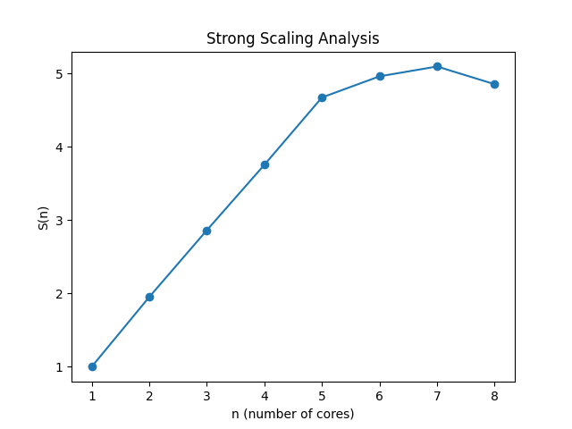

# Milestone 2 (Project 1)

The purpose of this assignment is to demonstrate the speedups possible when parallelizing our code utilizing different threads on our systems with the help of openmp. This is done for the simulation of advection/diffusion through explicit time stepping.

## Processor:

```
Chip:               Apple M1 Pro
Number of Cores:	8 (6 performance and 2 efficiency)
```

## Compiler:

```
Compiler:           GNU C++ compiler - g++
Version:            11
```

## Sample Run:
1. Step 1 - 
```
g++-11 ./milestone-2/advection_simulation.cpp -o ./milestone-2/advection_simulation -fopenmp
```

2. Step 2 - 
```
./milestone-2/advection_simulation 400 20000 1.0 1.0e6 5.0e-7 2.85e-7            
```

## Best Performance Parameters:
```
Cores:              6
Schedule:           guided
```

## Serial vs. Parallel Outputs:

To view whether there is any difference between the serial and parallel code outputs, we can run a diff. This is shown below - 
```
diff ./milestone-1/file_name.txt ./milestone-2/file_name.txt    
```

The **file_name.txt** can be any of the following files - 
1. initial_gaussian.txt
2. simulation_10000_timesteps.txt
3. simulation_15000_timesteps.txt
4. simulation_user_specified_timestep.txt

If there is no change in the output, we will get no output in the terminal after running the above code as there is no difference to be shown. If there is a difference between the two output files, we will see a representative output in the terminal after running the above command.

Upon running the code for all 4 file names listed above, there was no output in the terminal, indicating that the serial and parallel implementations had no change in output. This means that there **is** bitwise reproducibility.


## Best Grind Rate (N = 10000 and milestone-1 inputs):

Inputs - 
```
N = 10000 (Matrix Dimension)
NT = 20000 (Number of timesteps)
L = 1.0 (Physical Cartesian Domain Length) 
T = 1.0e6 (Total Physical Timespan)
u = 5.0e-7 (X velocity Scalar)
v = 2.85e-7 (Y velocity Scalar)
```

Best Grind Rate - 
```
Best Grind Rate = 7 timesteps/second
```

## Strong Scaling Analysis:

### Input - (1)
```
N = 3200 (Matrix Dimension)
NT = 400 (Number of timesteps)
L = 1.0 (Physical Cartesian Domain Length) 
T = 1.0e3 (Total Physical Timespan)
u = 5.0e-7 (X velocity Scalar)
v = 2.85e-7 (Y velocity Scalar)
```

### Data Points - (1)


| Cores       | time (s)    |
| ----------- | ----------- |
| 1           | 36.4707     |
| 2           | 18.6834     |
| 3           | 12.7379     |
| 4           | 9.7075     |
| 5           | 7.7995     |
| 6           | 7.3461     |
| 7           | 7.1528     |
| 8           | 7.5088     |

### Plot - (1)



We can observe the following - 
```
n_1/2 = 5
n_0.8 = 6
```

### Input - (2)
```
N = 200 (Matrix Dimension)
NT = 400 (Number of timesteps)
L = 1.0 (Physical Cartesian Domain Length) 
T = 1.0e3 (Total Physical Timespan)
u = 5.0e-7 (X velocity Scalar)
v = 2.85e-7 (Y velocity Scalar)
```

### Data Points - (2)


| Cores       | time (s)    |
| ----------- | ----------- |
| 1           | 0.15496     |
| 2           | 0.96304     |
| 3           | 0.090706     |
| 4           | 0.058696     |
| 5           | 0.064069     |
| 6           | 0.068613     |
| 7           | 0.087449     |
| 8           | 0.092364    |

### Plot - (2)


## Weak Scaling Analysis:

### Input -
```
N = 800 (Matrix Dimension) (1 thread - increases as the threads count increases)
NT = 400 (Number of timesteps)
L = 1.0 (Physical Cartesian Domain Length) 
T = 1.0e3 (Total Physical Timespan)
u = 5.0e-7 (X velocity Scalar)
v = 2.85e-7 (Y velocity Scalar)
```

### Data Points -


| Cores       | N      | time (s)    |
| ----------- | ----------- |----------- |
| 1           | 800     | 2.34124    |
| 2           | 1131     | 2.35585     |
| 3           | 1385     | 2.41521     |
| 4           | 1600     | 2.40799     |
| 5           | 1788     | 2.4846    |
| 6           | 1959     | 2.62962     |
| 7           | 2116     | 3.41103     |
| 8           | 2262    | 3.96412     |

### Plot -

